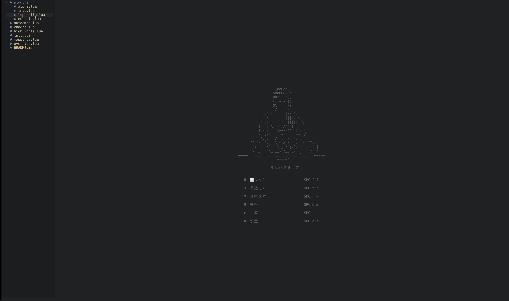
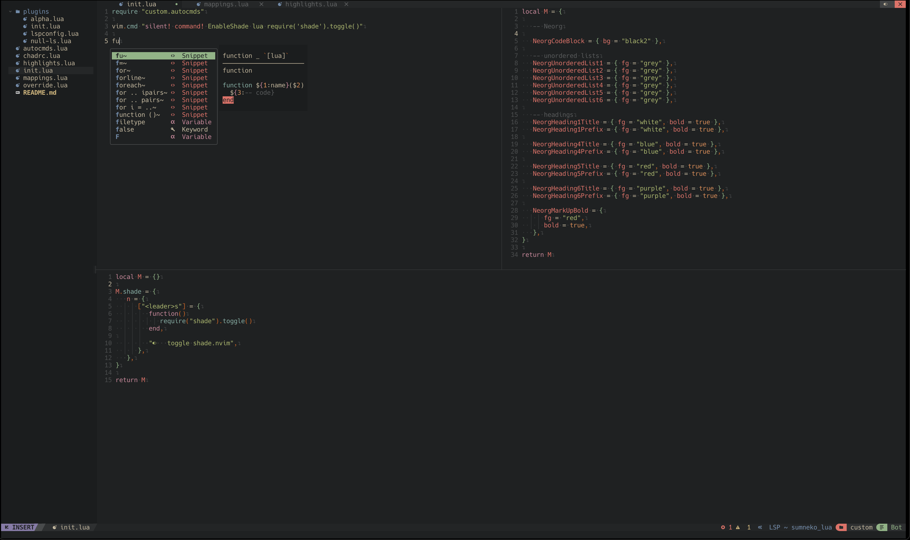
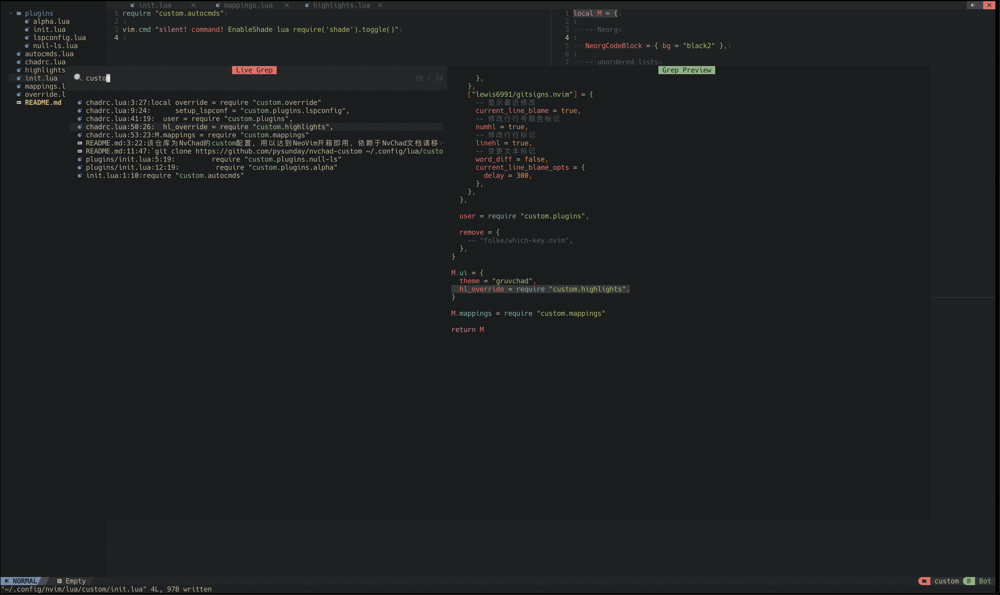

# 说明

该仓库为NvChad的custom配置，用以达到NeoVim开箱即用，依赖于NvChad文档请移步：

[NvChads github](https://github.com/NvChad/NvChad)

[NvChads Document](https://nvchad.github.io/)

# 安装

`git clone https://github.com/pysunday/nvchad-custom ~/.config/lua/custom --depth 1`

# 效果图

